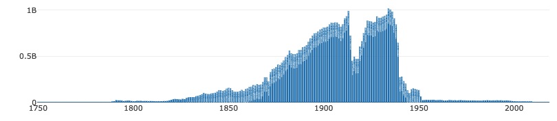
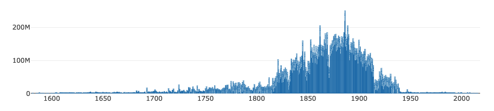
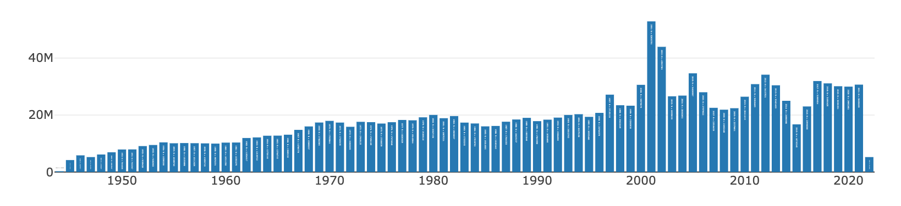

#rallicagram

Un micro package R pour importer des données de [Gallicagram](https://shiny.ens-paris-saclay.fr/app/gallicagram).

## Installation et importation
```R
library(devtools) #Assurez vous d'avoir le package devtools installé
install_github("regicid/rallicagram")
library(rallicagram)
```

## Usage
````R
gallicagram("josé",corpus="lemonde",debut=1960,fin=1970)
```

La fonction vous retourne un dataframe, avec pour colonnes le nombre d'occurrences (`n`), le nombre total de mots sur la période (`total`), la fréquence du mot calculée comme le rapport des deux (`ratio`), le syntagme recherché (`gram`), l'année (`annee`) et, selon le corpsu, le `mois` et le `jour`.


## Corpus
Ce package permet seulement de chercher dans les corpus qui ont été tokénisés pour le projet Gallicagram, c'est-à-dire :
* La presse de Gallica (corpus="presse"). 3 millions de numéros, fiable à partir de 1789 et jusqu'en 1950 (la faute aux droits d'auteur). Résolution mensuelle.

* Les livres de Gallica (corpus="livres"). 300 000 "monographies", de plus en plus fiable au fil des XVIIe et XVIIIe siècle, et ce jusqu'en 1950 (même raison). Résolution annuelle.

* Les archives du Monde de décembre 1944 au 22 février 2022 (corpus="lemonde"). Fiable tout au long de la période, résolution journalière. Impeccablement océrisé, contrairement à Gallica.

## Pour les passionnés
Plus d'informations dans notre [preprint](https://osf.io/preprints/socarxiv/84bf3/) consacré au projet et dans la notice du [site](https://shiny.ens-paris-saclay.fr/app/gallicagram).


